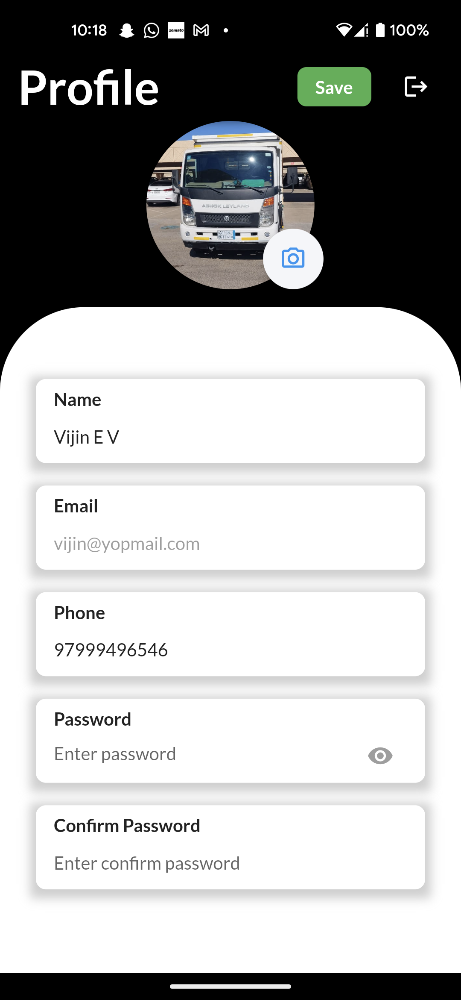

# KPMS Demo Application




This repository contains a demo application for the KPMS (Key Performance Management System) with features including user authentication, login, signup, and profile management. The application utilizes Firebase Authentication for user authentication.

## Features

- User authentication using Firebase Auth
- Login functionality
- Signup functionality
- Profile management

## Technologies Used

- Firebase Authentication
- HTML/CSS/JavaScript (Frontend)
- [Insert any additional technologies/frameworks used]

## Getting Started

To get started with the KPMS Demo Application, follow these steps:

1. Clone this repository to your local machine:

```bash
git clone https://github.com/your-username/kpms-demo.git
